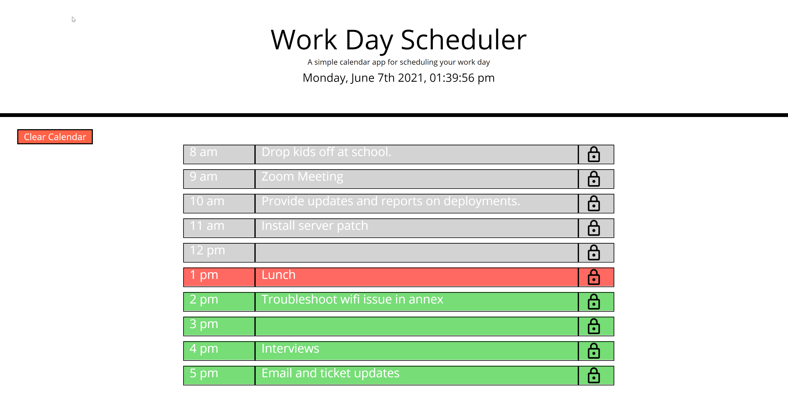

# TITLE: EVENT CALENDAR

## Project Title: event-calendar
Purpose: This project was created to explore JavaScript 3rd Party APIs including Bootstrap and jQuery. New skills learned include dynamically updating HTML and CSS powered by jQuery,
setting up a CSS framework (Bootstrap) and setting up and utilizing a JavaScript library (Moment.js). 


The project is an event calendar that allows a user to save, edit and delete events for each hour of the day in a browser, and uses dynamically 
updated HTML and CSS powered by jQuery.

**Creation date:** June 2021  
**Collaborators:** Sheri Elgin

## Screen Cap


## Project Links
GitHub Source Code: https://github.com/grudgecat/event-calendar  \
Site URL/Pages link: https://grudgecat.github.io/event-calendar/ 

***
## Dependencies 
**jQuery:** 
Project webpage: https://jquery.com/  
To include in project file:  
```
<script src="https://cdnjs.cloudflare.com/ajax/libs/jquery/3.2.1/jquery.min.js"></script>
```

**Bootstrap:** 
Project webpage: https://getbootstrap.com/  
To include in project file:
```
<link
  rel="stylesheet"
  href="https://stackpath.bootstrapcdn.com/bootstrap/4.3.1/css/bootstrap.min.css"
/>
```

**Moment.js:** \
Project webpage: https://momentjs.com/  
To include in project file:
```
<script src="https://cdnjs.cloudflare.com/ajax/libs/moment.js/2.24.0/moment.min.js"></script>
```
**Other:**  
Including imported fonts from Google Fonts and Fontawesome as follows:
```
<link
  rel="stylesheet"
  href="https://use.fontawesome.com/releases/v5.8.1/css/all.css"
  integrity="sha384-50oBUHEmvpQ+1lW4y57PTFmhCaXp0ML5d60M1M7uH2+nqUivzIebhndOJK28anvf"
  crossorigin="anonymous"
/>
<link
  href="https://fonts.googleapis.com/css?family=Open+Sans&display=swap"
  rel="stylesheet"
/>
```

***
## Expected Behavior 
_Pseudocode/Expected bevhavior:_   
GIVEN I am using a daily planner to create a schedule
WHEN I open the planner
THEN the current day is displayed at the top of the calendar
WHEN I scroll down
THEN I am presented with timeblocks for standard business hours
WHEN I view the timeblocks for that day
THEN each timeblock is color coded to indicate whether it is in the past, present, or future
WHEN I click into a timeblock
THEN I can enter an event
WHEN I click the save button for that timeblock
THEN the text for that event is saved in local storage
WHEN I refresh the page
THEN the saved events persist
WHEN I click the Clear Calendar button
THEN the events are cleared off page and out of local memory and page is refreshed.
